# Dossier

> My work history, automatically turned into professional documents.

Dossier collects my git commits, code diffs, and Linear tasks to automatically generate a brag document, a one-page resume, and a multi-page CV — then publishes them to the web via GitHub Pages.

---

## How it works



1. **Collect** — Walks every repository in my `/projects` directory, pulling commit messages and diffs. Simultaneously fetches all Linear issues I worked on via the Linear API.
2. **Synthesize** — Combines the raw data into structured context: what you shipped, what problems you solved, who you collaborated with.
3. **Generate** — Produces three documents using that context:
   - **Brag document** — 5–10 pages covering my goals, projects, collaboration, mentorship, design/documentation contributions, company building, learning, and outside-of-work highlights.
   - **Resume** — One page, generated with [RenderCV](https://github.com/sinaatalay/rendercv).
   - **CV** — Multi-page, generated with [RenderCV](https://github.com/sinaatalay/rendercv).
4. **Publish** — A CI/CD pipeline builds the PDFs and deploys them to GitHub Pages, rendered in the browser via [pdf.js](https://mozilla.github.io/pdf.js/).

---

## Documents generated

### Brag Document
A structured self-review covering:
- My goals for this year and next
- Projects I shipped
- Collaboration & mentorship
- Design & documentation
- Company building contributions
- What I learned
- Outside of work

### Resume (1 page)
Concise and ATS-friendly. Pulls the most impactful highlights from my brag document and git/Linear history.

### CV (multi-page)
Full career record with detailed project descriptions, technologies used, and measurable outcomes.

---

## Data sources

| Source | What it provides |
|--------|-----------------|
| Git repositories (`/projects/**`) | My commit messages, diffs, project names, activity timeline |
| Linear API | Tasks I worked on, issue titles, cycle/project context |
| Generated brag document | Narrative context fed into resume and CV generation |

---

## Tech stack

- **Data collection** — Python scripts for git traversal and Linear API integration
- **Document generation** — [RenderCV](https://github.com/sinaatalay/rendercv) for resume and CV
- **CI/CD** — GitHub Actions for automated builds on a schedule or push
- **Web viewer** — GitHub Pages + [pdf.js](https://mozilla.github.io/pdf.js/) for in-browser PDF display

---

## Build stages

The pipeline lives in [`dossier.py`](dossier.py). Run everything with `uv run dossier.py`, or pick a subset with `uv run dossier.py <stage> [<stage> ...]`. List stages with `uv run dossier.py --list`.

| Stage         | What it does |
|---------------|--------------|
| `render`      | Renders `sources/resumes/SDE2_CV.yaml` to PDF + PNG via RenderCV, into `artifacts/resumes/`. |
| `publish-pdf` | Copies the rendered PDF into `deployments/cf-workers/public/vibhakar-solanki-sde2-resume.pdf` for the Worker to serve. |
| `render-anon` | Writes `SDE2_CV.anon.generated.yaml` with header + socials redacted, then renders it. |
| `og-image`    | Builds a 1200×630 `og-image.png` via `deployments/scripts/build_og_image.py`. |

---

## Project structure

```
dossier/
├── dossier.py                            # Pipeline entrypoint (render, publish-pdf, render-anon, og-image)
├── pyproject.toml
├── uv.lock
├── sources/
│   └── resumes/
│       ├── SDE2_CV.yaml                  # Source of truth for the resume
│       ├── SDE2_CV.anon.generated.yaml   # Written by `render-anon`
│       └── fonts/
├── artifacts/
│   └── resumes/                          # RenderCV output (PDF, PNG, Typst)
├── deployments/
│   ├── cf-workers/
│   │   ├── worker.js                     # Cloudflare Worker (SEO, OG tags, viewer routing)
│   │   ├── wrangler.toml
│   │   └── public/
│   │       ├── vibhakar-solanki-sde2-resume.pdf  # Published by `publish-pdf`
│   │       ├── og-image.png              # Built by `og-image`
│   │       └── pdfjs/                    # Vendored pdf.js viewer
│   └── scripts/
│       └── build_og_image.py
└── static/
    └── artifact_pipeline_diagram.svg
```

---

## Setup

```bash
git clone https://github.com/your-username/dossier
cd dossier
uv sync
```

Run the full build pipeline:

```bash
uv run dossier.py
```

Run a subset of stages (e.g. re-render and publish after a YAML edit):

```bash
uv run dossier.py render publish-pdf
```

List available stages:

```bash
uv run dossier.py --list
```

---

## CI/CD pipeline

The GitHub Actions workflow:
1. Runs on a schedule (e.g. weekly) or on push to `main`
2. Executes all collectors and generators
3. Commits updated PDFs to the `gh-pages` branch
4. GitHub Pages serves the pdf.js viewer pointing at the latest PDFs

---

## License

MIT
