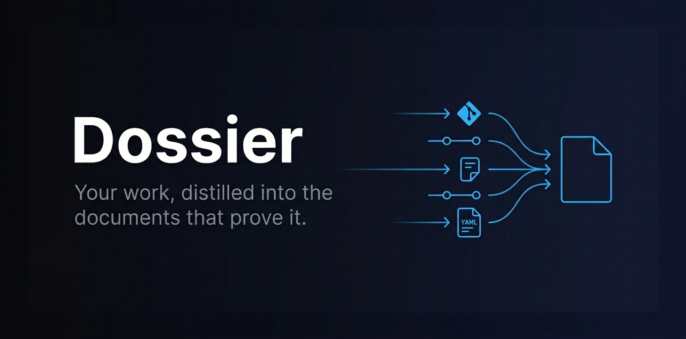
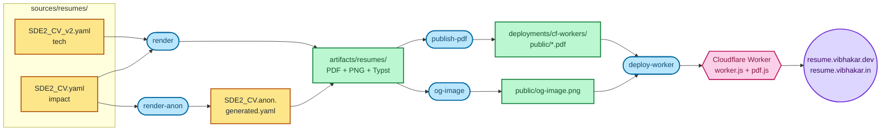

<p align="center">
  
</p>

# Dossier

> My work history, automatically turned into professional documents.

Dossier renders my resume from a YAML source of truth and publishes it via a Cloudflare Worker.

---

## How it works



1. **Render** — `render` runs [RenderCV](https://github.com/sinaatalay/rendercv) on both YAML variants (tech + impact); `render-anon` produces a redacted variant for public feedback.
2. **Stage assets** — `publish-pdf` copies the PDFs into the Worker's `public/` directory; `og-image` builds a 1200×630 social preview from the rendered PNG.
3. **Deploy** — `deploy-worker` ships `public/` via `wrangler` to a Cloudflare Worker that serves the PDF directly (with SEO + OG tags) and a vendored [pdf.js](https://mozilla.github.io/pdf.js/) viewer for browsers.

---

## Documents generated

### Resume (1 page)
Concise and ATS-friendly, rendered from `sources/resumes/SDE2_CV.yaml`.

### Anonymized resume
A redacted version (header + socials stripped) for public feedback, written to `SDE2_CV.anon.generated.yaml`.

---

## Tech stack

- **Document generation** — [RenderCV](https://github.com/sinaatalay/rendercv) for the resume
- **Hosting** — Cloudflare Worker serving the PDF and pdf.js viewer
- **Web viewer** — Vendored [pdf.js](https://mozilla.github.io/pdf.js/) for in-browser PDF display

---

## Build stages

The pipeline lives in [`dossier.py`](dossier.py). Run everything with `uv run dossier.py`, or pick a subset with `uv run dossier.py <stage> [<stage> ...]`. List stages with `uv run dossier.py --list`.

| Stage           | What it does |
|-----------------|--------------|
| `render`        | Renders both resume variants (tech + impact) to PDF + PNG via RenderCV, into `artifacts/resumes/`. |
| `publish-pdf`   | Copies both rendered resume PDFs into `deployments/cf-workers/public/` for the Worker to serve. |
| `render-anon`   | Writes `SDE2_CV.anon.generated.yaml` with header + socials redacted, then renders it. |
| `og-image`      | Builds a 1200×630 `og-image.png` from the RenderCV PNG output. |
| `deploy-worker` | Deploys the Cloudflare Worker (publishes `public/` assets to `resume.vibhakar.{dev,in}`). |

---

## Project structure

```
dossier/
├── dossier.py                            # Pipeline entrypoint
├── pyproject.toml
├── uv.lock
├── sources/
│   └── resumes/
│       ├── SDE2_CV.yaml                  # Source of truth for the resume
│       ├── SDE2_CV.anon.generated.yaml   # Written by `render-anon`
│       └── fonts/
├── artifacts/
│   └── resumes/                          # RenderCV output (PDF, PNG, Typst)
├── deployments/
│   ├── cf-workers/
│   │   ├── worker.js                     # Cloudflare Worker (SEO, OG tags, viewer routing)
│   │   ├── wrangler.toml
│   │   └── public/
│   │       ├── vibhakar-solanki-sde2-resume.pdf  # Published by `publish-pdf`
│   │       ├── og-image.png              # Built by `og-image`
│   │       └── pdfjs/                    # Vendored pdf.js viewer
│   └── scripts/
│       └── build_og_image.py
└── static/
    └── artifact_pipeline_diagram.svg
```

---

## Setup

```bash
git clone https://github.com/your-username/dossier
cd dossier
uv sync
```

Run the full build pipeline:

```bash
uv run dossier.py
```

Run a subset of stages (e.g. re-render and publish after a YAML edit):

```bash
uv run dossier.py render publish-pdf
```

List available stages:

```bash
uv run dossier.py --list
```

---

## ThingsToAdd

Features described in earlier drafts but not yet implemented:

- **Git collector** — Walk every repository in `/projects`, pulling commit messages and diffs to feed downstream generators.
- **Linear collector** — Fetch issues I worked on via the Linear API for task/cycle/project context.
- **Context synthesis** — Combine raw git + Linear data into structured context (what shipped, problems solved, collaborators).
- **Brag document generator** — 5–10 page self-review covering goals, projects, collaboration, mentorship, design/docs, company building, learning, and outside-of-work highlights. Intended to feed the resume/CV generators as narrative context.
- **CV (multi-page)** — Full career record with detailed project descriptions, technologies used, and measurable outcomes. Currently only the 1-page resume is generated.
- **GitHub Actions CI/CD** — Scheduled (e.g. weekly) and push-triggered workflow that runs collectors + generators and commits PDFs to a `gh-pages` branch.
- **GitHub Pages hosting** — Serve the pdf.js viewer from GitHub Pages pointing at the latest PDFs. (Currently hosted via Cloudflare Worker instead.)

---

## License

MIT
